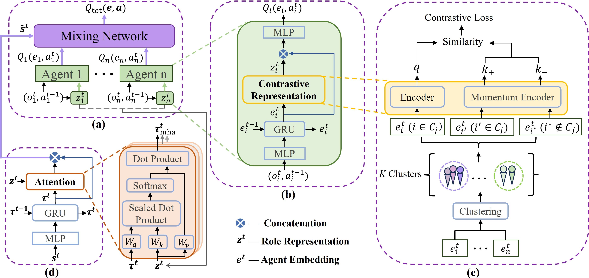

# **Attention-Guided Contrastive Role Representations for Multi-agent Reinforcement Learning**

Zican Hu, Zongzhang Zhang, Huaxiong Li, Chunlin Chen, Hongyu Ding, Zhi Wang*

A link to our paper can be found on [Paper Link](https://openreview.net/forum?id=LWmuPfEYhH)

## **Overview**



## **Instructions**

ACORM tested on two benchmark tasks [SMAC ](https://github.com/oxwhirl/smac) and [GRF](https://github.com/google-research/football) based on two algorithm framework [QMIX](https://arxiv.org/abs/1803.11485) and [MAPPO](https://arxiv.org/abs/2103.01955).

## **Citation**

Please cite our paper as:

@inproceedings{
hu2024attentionguided,
title={Attention-Guided Contrastive Role Representations for Multi-agent Reinforcement Learning},
author={Zican Hu and Zongzhang Zhang and Huaxiong Li and Chunlin Chen and Hongyu Ding and Zhi Wang},
booktitle={The Twelfth International Conference on Learning Representations},
year={2024},
url={https://openreview.net/forum?id=LWmuPfEYhH}
}

## **experiment instructions**

### **Installation instructions**
Download the Linux version 4.10 of StarCraft II from the Blizzard's [repository](https://github.com/Blizzard/s2client-proto#downloads).By default, the game is expected to be in `~/StarCraftII/` directory.
See requirments.txt file for more information about how to install the dependencies.
```python
conda create -n acorm python=3.9.16 -y
conda activate acorm
pip install -r requirements.txt
```

### Run an experiment

You can execute the following command to run ACORM_QMIX with a map config, such as `MMM2`:

```python
python ACORM_QMIX/main.py --algorithm ACORM --env_name MMM2 --cluster_num 3 --max_train_steps 3050000
```
or you can execute the following command to run ACORM_MAPPO with a map config, such as `corridor`

```python
python ACORM_MAPPO/main.py --algorithm ACORM --env_name corridor --cluster_num 3 --max_train_steps 5050000
```

All results will be stored in the `ACORM_QMIX or ACORM_MAPPO/results` folder. You can see the console output, config, and tensorboard logging in the `ACORM_QMIX or ACORM_MAPPO/results/tb_logs` folder.

You can plot the curve with `seaborn`:

```python
python plot.py --algorithm 'ACORM_QMIX' or 'ACORM_MAPPO'
```

## License

Code licensed under the Apache License v2.0.

